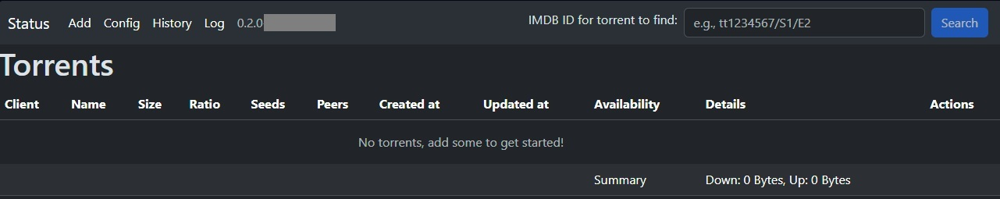

# YATBC
YATBC is an application for Self-Hosting enthusiasts with TorBox api key who like to store files on their local media.

_Disclamer: This application was developed for educational purposes only and is provided "as is" without any warranty._

## Is this app for you?
1. You like self-hosting
2. You like storing all your files localy
3. You don't mind minimal gui
4. You are familiar with docker-compose
5. You like automation
6. You don't need/wan't to use full Arr Stack
6. *You have TorBox api key*

## How this app works?
*TLDR*: YATBC automates workflow of using TorBox, downloading files to local drive and moving/coping them when done
1. You can configure the target folders for media types
2. You can add magnet links or search using TorBox's search(usfull if you intend to download something that is already in TorBox cache)
3. When download is ready on TorBox, the YATBC will download it using Aria2c
4. When Aria2c will finish downloading, YATBC will copy downloaded file to configured target folder based on media type
5. YATBC will inform you about every importand action via easy(hopefully) accessible logs related to files

## Some screen shots:

  
  
  
  
  

## Future plans/TODO list
1. Support for Transmission as backup client
2. Support for web links
3. Support for yt-dlp as backup web links client
4. Auto extracting and cleanup, if file contains unexpected files, they can be auto removed

## How to run it?
*TLDR*: Adjust docker-compose.yaml to your needs, run it and access main app on default 7097 port.
1. Download [Docker-compose.yaml](docker/docker-compose.yaml) and adjust it for your needs.
   Typicaly:
   - All the `volumes` (make sure user configured in docker compose - UID 1000 by default - has read/write rights to all those folders):
     - `persistent_data`: here the application stores all logs, configurations, database, session etc. Recomended folder is a subfolder of folder holding docker-compose.yaml
     - `aria_data`: here Aria2c will store downloaded files
     - `movies_data`: if torrent is marked as movies and has action on finish configured(config/folders), then the downloaded files will be copied/moved here from `aria_data`
     - `movie_series_data`: as above, just for movie series
     - `books_data`: similar to above
     - `audio_data`: similar to above
     - `other_data`: similar to above
     - `home_data`: similar to above
     - `environment`: adjust timezone offset to the timezone you want `- TZ=UTC+2`
     - `ports:- "7097:80"`: httpd port(`yatbc-gui`), if you don't want to run it on default "7097"
     - `ports:- "6800:6800" "`: aria2c port(`yatbc-aria`), if you don't want to run it on default "6800"
     - *Not recomended* If you need to run docker with different user than `UID=1000`, adjust docker files, modify Apache2 configuration(yatbc-gui/my-httpd.conf) to run as new user, rebuild images and change the: `user: "1000:1000"` to your prefered value. 
     
2. Start docker compose: `docker compose -f docker-compose.yaml up`, during first run, the `yatbc-prepare` will create in `persistent_data` all initial configs, SQLite database file etc. In your prefered web browser open your host adress on seleced httpd port(`7097` by default, so if you are running it on your local machine, try http://localhost:7097) and fill the initial configuration.
   - Minimal configuration:
     - TorBox API key and press `Validate TorBox` to check if it is ok
     - All other, should work with default values, but you can check Aria2c connection before first download
     - If you only changed the named volumes in docker-compose, leave Folders tab as is
   - `Save` and then go to `Status` page, wait few seconds, and you should see if worker connection is working as expected. You should see the status just below the navigation bar.

3. If everything is working, exit docker-compose, and restart it with `-d` parameter: `docker compose -f docker-compose.yaml up -d`. That is it.

## FAQ:
1. Do I have to configure all volumes? Like `home_data`, `other_data`?
   - You can configure just the ones that you will use (minimum is `aria_data` and `persistent_data`).

2. I see in the logs: `Could not get torrents: HTTPSConnectionPool(host='api.torbox.app', port=443): Max retries exceeded with url: /v1/api/torrents/mylist`
   - Have you recently (re)started docker? If so, wait a moment for DNS to go up and it should work as expected.

3. Can I add extra db_worker?
   - Currently only one db_worker is supported.

4. Why some parts of the application are marked: `here be dragons`?
   - Those are parts that are in long term development. I don't want to disable them, becase feature flags/handling are extra work. I also don't have separate production enviroment as in `Everyone have test enviroments, and some even have production enviroments`.

5. I see `No active worker is running` in task status
   - If you are sure it is running(no errors in docker compose), then wait a moment, it should refresh.

6. Can I use my own Aria2c instance?
   - Sure, remember to configure it in the Config/Aria.

7. When I add more torrents than my TorBox account has download slots, I don't see the extra files in Queue.
   - YATBC at the moment doesn't support queueing torrents.

