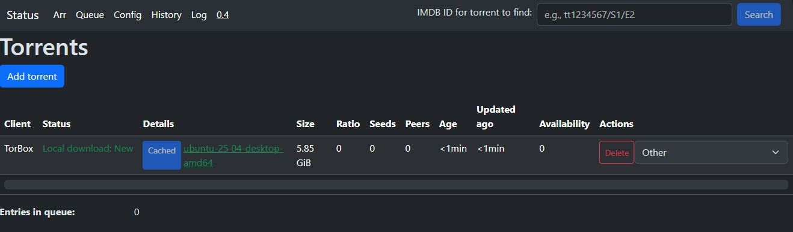

# YATBC
YATBC is an application for Self-Hosting enthusiasts with TorBox api key who like to store files on their local media.

_Disclaimer: This application was developed for educational purposes only and is provided "as is" without any warranty._

## Is this app for you?
1. You like self-hosting
2. You like storing all your files locally
3. You don't mind minimal gui
4. You are familiar with docker-compose
5. You like automation
6. You don't need/wan't to use full Arr Stack
6. *You have TorBox api key*

## How this app works?
*TLDR*: YATBC automates workflow of using TorBox, downloading files to local drive and moving/coping them when done
1. You can configure the target folders for media types
2. You can add magnet links, search using TorBox's search(useful if you intend to download something that is already in TorBox cache) or use simple Movie Series Monitoring to fill media libraries with content.
3. When download is ready on TorBox, the YATBC will download it using Aria2c
4. When Aria2c will finish downloading, YATBC will copy downloaded file to configured target folder based on media type.
5. YATBC will inform you about every important action via easy(hopefully) accessible logs related to files

## Integrations
All Integrations can be enabled/disabled in configuration.
1. Media libraries integration (like Jellyfin). Integration works for torrents marked as Movie Series or Movie type. When file will finish downloading to local storage, the app will adjust it's name to {title} {SNumber}{ENumber}. If the file was added via TorBox's search api, it will also contain the id in the folders name.  
2. Stash integration. Integration works for torrents marked as Home Video. When file will finish downloading to local storage, the app will call Stash's graphql api to scan new folder.
3. Auto-cleaning download slots. If Download Queue will contain entries and this integration is enabled, when queue will be processed some active downloads(finished more then 1h ago, cached) may be automatically removed. 

## Arr
Supports Movie Series monitoring based on build-in TorBox search api.
Monitoring is done by: Quality, Encoder, Include words, Exclude words, presence in cache.

## Internal Queue
YATBC has internal queue, if you want to add large number of files, but have no free slots, YATBC will store them in internal queue.
*Queue folders will be created on first entry to queue. So if you don't see the right folder structure then wait ~10 minutes or enter Queue page.*
1. YATBC monitors folders for new torrent files in: `/data/persistent/queue/[torrent_type]/[private|public]/*`. Example: you want to add torrent files to Other type from public tracker, then path on docker will be: `/data/persistent/queue/other/public`
2. *Torrent files added to queue will be removed*
3. YATBC takes files from queue:
   - When user manually deletes one of active downloads(Sends them to History)
   - Every 10 minutes (by default) and Active cleaning is active ("config/Queue") and will find some downloads to clean(Check configuration page for details)

## Some screen shots:

  
  
  
  
  
  
  

## Future plans/TODO list
1. Support for Transmission as backup client
2. Support for web links
3. Support for yt-dlp as backup web links client
4. Auto extracting and cleanup, if file contains unexpected files, they can be auto removed

## How to run it?
*TLDR*: Adjust docker-compose.yaml to your needs, run it and access main app on default 7097 port.
1. Download [Docker-compose.yaml](docker/docker-compose.yaml) and adjust it for your needs.
   Typically:
   - All the `volumes` (make sure user configured in docker compose - UID 1000 by default - has read/write rights to all those folders):
     - `persistent_data`: here the application stores all logs, configurations, database, session etc. Recommended folder is a subfolder of folder holding docker-compose.yaml
     - `aria_data`: here Aria2c will store downloaded files
     - `movies_data`: if torrent is marked as movies and has action on finish configured(config/folders), then the downloaded files will be copied/moved here from `aria_data`
     - `movie_series_data`: as above, just for movie series
     - `books_data`: similar to above
     - `audio_data`: similar to above
     - `other_data`: similar to above
     - `home_data`: similar to above
     - `environment`: adjust timezone offset to the timezone you want `- TZ=Europe/Warsaw`
     - `ports:- "7097:80"`: httpd port(`yatbc-gui`), if you don't want to run it on default "7097"
     - `ports:- "6800:6800" "`: aria2c port(`yatbc-aria`), if you don't want to run it on default "6800"
     - *Not recommended* If you need to run docker with different user than `UID=1000`, adjust docker files, modify Apache2 configuration(yatbc-gui/my-httpd.conf) to run as new user, rebuild images and change the: `user: "1000:1000"` to your preferred value. 
     
2. Start docker compose: `docker compose -f docker-compose.yaml up`, during first run, the `yatbc-prepare` will create in `persistent_data` all initial configs, SQLite database file etc. In your preferred web browser open your host address on selected httpd port(`7097` by default, so if you are running it on your local machine, try http://localhost:7097) and fill the initial configuration.
   - Minimal configuration:
     - TorBox API key and press `Validate TorBox` to check if it is ok
     - All other, should work with default values, but you can check Aria2c connection before first download
     - If you only changed the named volumes in docker-compose, leave Folders tab as is
   - `Save` and then go to `Status` page, wait few seconds, and you should see if worker connection is working as expected. You should see the status just below the navigation bar.

3. If everything is working, exit docker-compose, and restart it with `-d` parameter: `docker compose -f docker-compose.yaml up -d`. That is it.

## FAQ:
1. Do I have to configure all volumes? Like `home_data`, `other_data`?
   - You can configure just the ones that you will use (minimum is `aria_data` and `persistent_data`), but the app will be more functional with all folders configured.

2. I see in the logs: `Could not get torrents: HTTPSConnectionPool(host='api.torbox.app', port=443): Max retries exceeded with url: /v1/api/torrents/mylist`
   - Have you recently (re)started docker? If so, wait a moment for DNS to go up and it should work as expected.

3. Can I add extra db_worker?
   - Currently only one db_worker is supported.

4. Why some parts of the application are marked: `here be dragons`?
   - Those are parts that are in long term development. I don't want to disable them, because feature flags/handling are extra work. I also don't have separate production environment as in `Everyone have test environments, and some even have production environments`.

5. I see `No active worker is running` in task status
   - If you are sure it is running(no errors in docker compose), then wait a moment, it should refresh.

6. Can I use my own Aria2c instance?
   - Sure, remember to configure it in the Config/Aria.

7. When I add more torrents than my TorBox account has download slots, I don't see the extra files in TorBox Queue.
   - YATBC will add them to internal queue. If there will be free download slot(you can enable auto cleaning in config), YATBC will fill them from internal queue. Queue by default is processed every 10 minutes or on torrent removal.

8. What the Download Statuses mean(column Status in Status page)?
   - `Unknown` - File is in unknown state
   - `Client: Init` - YATBC have sent the file for processing to Remote Client (TorBox by default) 
   - `Client: Added` - Remote client added file and will work on it
   - `Client: In Progress` - Remote client is working on file
   - `Client: Done` - Remote client has finished working on files and is ready to send the download links
   - `Client: Error` - Remote client reported error
   - `Local download: Error` - Local downloader(Aria2 by default) reported error. In default configuration Aria2 will try to repeat downloading. If the error will persist, user intervention will be needed.
   - `Local download: New` - Got link from remote client and YATBC have send it to Local downloader to download it
   - `Local download: Progress` - Local downloader is downloading file(s)
   - `Local download: Done` - All related to this download files, have finished downloading to local media
   - `Finish: Started` - Action on finish has started
   - `Finish: Progress` - Action on finish is working
   - `Finish: Done` - Action on finish is done
   - `Finish: Error` - There was an error with action on finish, and user intervention will be required

9. Where can I find manual for Movie Series monitoring?
   - In Arr tab, press Help button. There should be up to date manual.